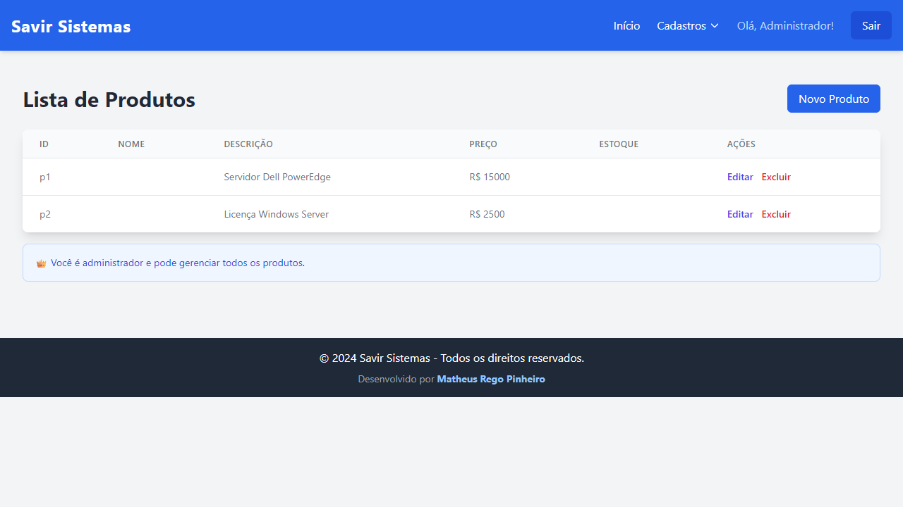
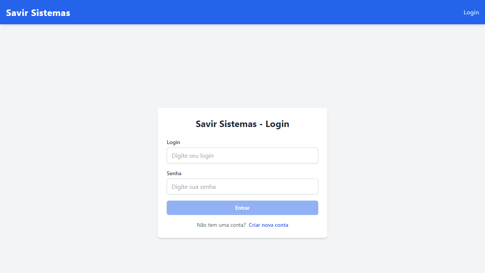

# Savir Sistemas 🚀

Plataforma Full-Stack de gestão corporativa construída com o stack MEAN (MongoDB, Express, Angular, Node.js). O projeto foca em prover uma interface ágil e responsiva para administração de recursos empresariais, com uma arquitetura backend leve e adaptada para ambientes Serverless.

## 📸 Screenshots da Aplicação

<div align="center">
  
  
  
  
</div>

## 🛠️ Tecnologias Utilizadas

### Front-end
- **Angular 20:** Framework principal para a construção de SPAs escaláveis.
- **Tailwind CSS:** Estilização utilitária para prototipagem rápida e interfaces modernas.
- **TypeScript:** Tipagem estática garantindo maior segurança e manutenibilidade do código.
- **RxJS:** Programação reativa para controle complexo de estados e eventos assíncronos.

### Back-end & Infraestrutura
- **Node.js & Express:** API leve e modular para gestão de regras de negócio.
- **MongoDB & Mongoose:** Banco de dados NoSQL e ODM para modelagem flexível de documentos.
- **Vercel Serverless:** Implantação do backend utilizando Serverless Functions para otimização de custos e performance (`/api/*.js`).

## ⚙️ Arquitetura e Deploy (Vercel)

Diferente de aplicações Node.js tradicionais, o backend deste projeto (`mongo-adapter/` e `/api/`) foi estruturado para suportar o modelo Serverless da Vercel. 
- A conexão com o MongoDB é reutilizada inteligentemente entre invocações para não exceder limites de pool do Atlas.
- O front-end (Angular) é buildado como arquivo estático, garantindo entrega ultrarrápida (CDN).

*(Veja `README-MONGO-VERCEL.md` para mais instruções de deploy)*.

## 🚀 Como rodar o projeto localmente

1. **Clone o repositório:**
   ```bash
   git clone https://github.com/Mattys03/savir-sistemas.git
   cd savir-sistemas
   ```

2. **Instale as dependências:**
   ```bash
   npm install
   ```

3. **Configure o Banco de Dados:**
   - Crie um arquivo `.env` na raiz do projeto.
   - Adicione a sua string de conexão do MongoDB Atlas:
     ```env
     MONGODB_URI=mongodb+srv://<usuario>:<senha>@cluster...
     ```

4. **Inicie o servidor de desenvolvimento (Front-end e Back-end):**
   Para rodar a aplicação localmente utilizando o ambiente do Vercel:
   ```bash
   vercel dev
   ```
   *(Alternativamente, pode-se usar `npm run start` para a API isolada e `npm run dev` para o Angular).*

## 📌 Funcionalidades Principais
- Gerenciamento de Usuários.
- Catálogo de Clientes e Produtos.
- Interface UI/UX otimizada para alta produtividade em operações corporativas CRUD.

---
**Autor:** Matheus Rêgo Pinheiro ([@Mattys03](https://github.com/Mattys03))
